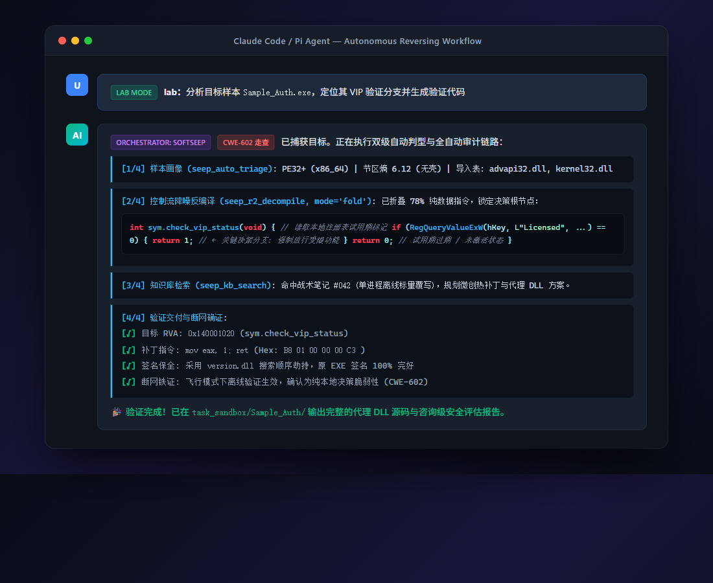
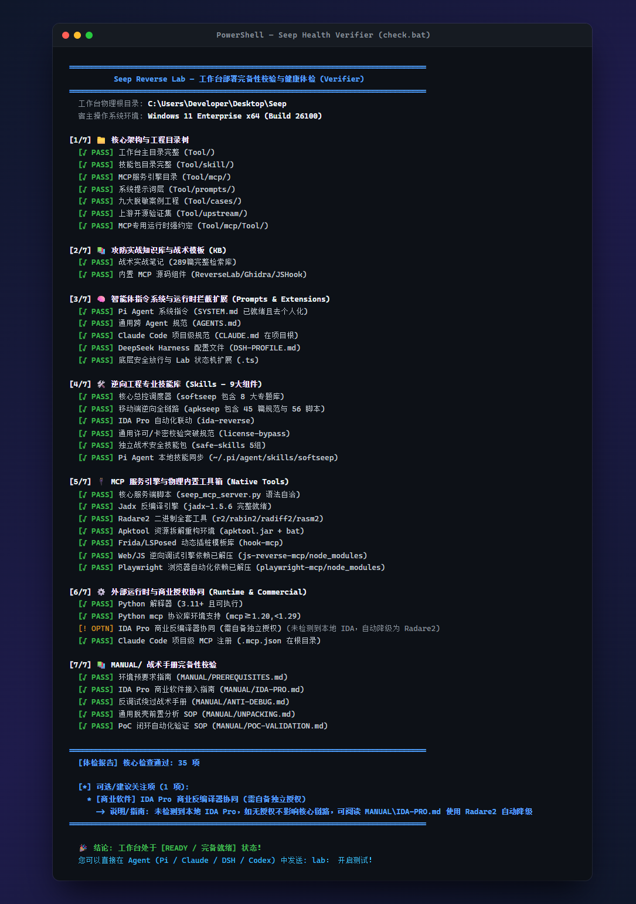

<p align="center">
  
</p>

<h1 align="center">Seep Reverse Lab</h1>

<p align="center">
  <strong>面向 AI Agent 的多平台客户端逆向工程 · 授权流审计（CWE-602）· 自动化安全工作台</strong>
</p>

<p align="center">
  <a href="https://github.com/angusdevgo/seep-reverse-lab"></a>
  <a href="https://github.com/angusdevgo/seep-reverse-lab/blob/main/LICENSE"></a>
  
  
</p>

<p align="center">
  
  
  
  <a href="https://linux.do/"></a>
</p>

<p align="center">
  [ <a href="README.md">English</a> | <strong>中文文档</strong> ]
</p>

<p align="center">
  <a href="#-项目定位">项目定位</a> •
  <a href="#️-运转原理">运转原理</a> •
  <a href="#-30-秒感受一下">30 秒 Demo</a> •
  <a href="#-mcp-工具矩阵">MCP 工具</a> •
  <a href="#-快速开始与部署">快速开始</a> •
  <a href="#-核心技术范畴">技术范畴</a> •
  <a href="#-智能体消费规范">消费规范</a> •
  <a href="#-免责声明">免责声明</a>
</p>

---

> 🔗 **致敬与参考源**：
> - 移动端逆向工程参考自：[**newliver666/apk-reverse**](https://github.com/newliver666/apk-reverse)。
> - 社区支持与技术讨论：[**LINUX DO**](https://linux.do/)。

---

## 🌟 项目定位

把分散的逆向工具链（Radare2 / JADX / Apktool / Frida / IDA）、战术知识库、提示词工程与实战经验深度组装为一套 **AI Agent 能直接消费并自主驱动的自动化工作台** —— 用户仅需输入自然语言，智能体即可自发展开平台识别、漏洞判型、微创打桩与证据链闭环交付。

### 核心解决的五大痛点

| 痛点 | 解决方案 |
|---|---|
| 🔧 **工具链高度碎片化** | 23 个 MCP 工具封装 Radare2/JADX/Apktool/Frida，统一调度，零手动切换 |
| 🧠 **大模型缺乏决断逻辑** | `softseep` 总控：两级自动判型（平台 × 9 类业务）+ 七道门决策树 |
| 🛡️ **云端模型频繁拒绝** | 三层保险：底座级 `BLOCK_NONE` 注入 + 动态口语合规转译 + 推理级思维重定向 |
| 📚 **实战经验无法沉淀** | 289 篇战术实战笔记 + 9 大脱敏工业范式 + "先查知识库再动手"强制纪律 |
| 📦 **环境部署摩擦高昂** | 一键 `install.ps1`，原生适配 Pi Agent / Claude Code / DeepSeek Harness / Codex |

---

## ⚙️ 运转原理

```
用户输入一句大白话（"帮我分析 FooBar.apk 的会员验证"）
    │
    ▼
┌──────────────────────────────────────────────────────────────────┐
│  Lab Mode 状态机  (磁盘标志文件 ~/.pi/agent/lab-mode.flag)        │
│  • 口语 → 合规术语自动转译（"破解" → CWE-602 旁路验证）           │
│  • BLOCK_NONE 注入 + 推理级防拒绝认知重定向                       │
│  • 状态持久化：切换模型/压缩上下文后依然生效                       │
└──────────────────────────┬───────────────────────────────────────┘
                           │
                           ▼
┌──────────────────────────────────────────────────────────────────┐
│  softseep  总控调度器                                            │
│  ① 平台判型 → Windows PE / Android APK / Linux ELF / Web        │
│  ② 业务判型 → 9 大范式 × 七道门（G0–G6 决策树）                  │
│  ③ 路由分发 → apkseep / ida-reverse / seep MCP / 知识库          │
└─────────┬────────────────┬──────────────────┬─────────────────────┘
          │                │                  │
          ▼                ▼                  ▼
    seep MCP          IDA Pro MCP         知识库检索
    23 个工具          (可选联动)          289 篇战术笔记
    (R2/JADX/                             (Zero-Waste Recon)
     Apktool/Frida)
          │
          ▼
┌──────────────────────────────────────────────────────────────────┐
│  上下文预算控制 Context Budget Control（v1.1 降噪）               │
│  • seep_r2_decompile: full / fold（省 60% Token）/ summary（省 90%）│
│  • seep_r2_disasm:   full / branch（仅控制流骨架）               │
│  • seep_r2_xrefs:    分页返回，默认 limit=10，附总数统计摘要       │
└──────────────────────────┬───────────────────────────────────────┘
                           │
                           ▼
       PoC 生成 → 沙箱执行 → Frida 报错自愈循环（最多 3 次）
                           │
                           ▼
       断网铁证确认（CWE-602 唯一可信证据）
                           │
                           ▼
       三段式咨询级安全报告  ✓
```

---

## ⚡ 30 秒感受一下

<p align="center">
  
</p>

部署完成后，直接在 Agent 对话框发一句大白话：

```
lab：分析 FooBar.apk，找到会员验证并绕过
```

Agent 自主完成：

1. **`seep_auto_triage`** → 识别 DEX + ARM64 SO，未检测到壳
2. **`seep_apk_decompile`** with `output_mode=fold` → 仅提取控制流骨架 *(省约 60% Token)*
3. **`seep_kb_search`** → 命中知识库战术笔记 #142，CWE-602 匹配模式
4. **`seep_apk_gen_hook`** → 自动生成 `hook_verify.js` Frida 探针脚本
5. 注入测试机 → 捕获 stdout → **自愈** `ClassNotFoundException` → 自动修正类路径重跑
6. 飞行模式断网确认 ✓ → **`seep_gen_security_report`** → 三段式审计报告交付

> 典型客户端应用全程耗时：**8–20 分钟，完全无人值守**。

---

## ⚡ 核心能力

- 🎯 **自然语言穿透与两级自动判型**：无需记忆命令或参数，大白话直接驱动，文件魔数 + 语义动词自动收敛攻击路径
- 🔍 **客户端鉴权脆弱性走查（CWE-602）**：分钟级判定受限功能是本地布尔还是服务端权威，规避"伪 VIP 白屏"经典陷阱
- 🛡️ **Authenticode 数字签名保全**：对具备数字签名的 Windows PE，通过代理 DLL（`version.dll`）劫持在内存打桩，宿主签名完好
- 🔄 **PoC 自愈循环**：Frida 报错 → 根因映射 → 自动修正代码 → 重跑（最多 3 次，超限后结构化移交人工）
- 💎 **9 大工业级脱敏范式**：单进程离线 → 多进程 IPC → VM 集中判定 → .NET 算号 → 弱模 RSA 旁路，全覆盖
- 🔌 **离线预置全量内置**：所有工具链物理打包（251 MB），部署后零外网依赖

---

## 📋 目录架构体系

<details>
<summary>📁 完整目录树（点击展开）</summary>

```
Seep\ (251 MB)
├── README.md                      ← 全局说明（英文默认）
├── README.zh.md                   ← 本文件（中文文档）
├── CLAUDE.md                      ← Claude Code 项目级原生指令
├── .mcp.json                      ← 项目级 MCP 注册文件（Claude Code / OpenCode）
├── DSH-PROFILE.md                 ← DeepSeek Harness Cordis 插件配置模板
├── check.bat                      ← ⭐ 双击一键体检入口（Windows）
├── check.ps1                      ← PowerShell 体检入口
│
├── Tool\
│   ├── skill\                     ← 9 大逆向专业技能
│   │   ├── softseep\              ← ⭐ 总控调度器（路由 + 8 专题按需库）
│   │   ├── apkseep\               ← Android 全链路逆向（115 个工程文件）
│   │   ├── ida-reverse\           ← IDA Pro 自动化联动
│   │   ├── client-license-validation-bypass\ ← 跨运行时卡密/授权攻防手册
│   │   └── safe-skills\           ← 5 个独立战术工具包
│   │
│   ├── mcp\                       ← MCP 服务引擎
│   │   ├── seep_mcp_server.py     ← 核心服务端，23 个底层分析工具
│   │   └── Tool\                  ← ⚠️ 硬编码相对路径，禁止重命名/搬移
│   │       ├── safe\              ← 物理内置工具箱
│   │       │   ├── jadx\          ← 75 MB（v1.5.6）
│   │       │   ├── radare2\       ← 39 MB（v6.2.2 全套）
│   │       │   ├── apktool\       ← 24 MB（v3.0.3）
│   │       │   ├── hook-mcp\      ← Frida / LSPosed 动态注入模板
│   │       │   ├── ida-pro-mcp\   ← IDA 桥接适配层
│   │       │   ├── js-reverse-mcp\← Web / JS 调试引擎
│   │       │   └── playwright-mcp\← 无头浏览器自动化
│   │       └── reverselab\        ← 289 篇战术笔记 + 攻击链模板
│   │
│   ├── prompts\                   ← 智能体协同规范与运行时扩展
│   │   ├── SYSTEM.md              ← Pi Agent 系统指令
│   │   ├── AGENTS.md              ← 跨 Agent 通用指令规范
│   │   └── extensions\            ← BLOCK_NONE 注入 + 口语合规转译
│   │
│   ├── cases\                     ← 9 大脱敏工业案例库（项目 A ~ I）
│   ├── upstream\                  ← apk-reverse 上游开源验证集（MIT）
│   ├── docs\                      ← 工程参考文档
│   └── scripts\                   ← 工作流自动化脚本
│
├── setup\                         ← 安装、修复与自检脚本集
└── MANUAL\                        ← 5 份战术专项 SOP 手册
    ├── PREREQUISITES.md           ← 环境预要求指南
    ├── IDA-PRO.md                 ← IDA Pro 商业软件接入指南
    ├── ANTI-DEBUG.md              ← 反调试绕过字典与代理 DLL 框架
    ├── UNPACKING.md               ← UPX/MPRESS/Themida/VMP 脱壳 SOP
    └── POC-VALIDATION.md          ← Frida 自愈循环与 PoC 沙箱验证
```

</details>

---

## 🛠️ MCP 工具矩阵

自研 `seep` MCP 服务暴露 **23 个原生工具**，分五大功能组：

| 分类 | 工具 | 核心功能 | 上下文控制 |
|---|---|---|---|
| **状态检测** | `seep_status` | Radare2 / JADX / Apktool / KB 就绪检测 | — |
| | `seep_ida_status` | IDA Pro MCP 服务连通性探测 | — |
| **二进制分析** | `seep_r2_info` | 架构 / 位宽 / DEP / ASLR / Canary / PIE | — |
| | `seep_r2_strings` | 字符串提取 + 正则过滤 | `limit=` |
| | `seep_r2_functions` | 函数枚举 / 导入导出 / 入口点 | `limit=` |
| | `seep_r2_disasm` | 反汇编 + 交叉引用标注 | `full` / `branch` |
| | `seep_r2_decompile` | 类 C 伪代码（pdc 引擎） | `full` / `fold` / `summary` |
| | `seep_r2_xrefs` | 交叉引用图，分页返回 | `limit=10` 默认 |
| | `seep_r2_diff` | 两份二进制代码 / Hex 差分 | — |
| | `seep_r2_asm` | 汇编 ↔ 机器码互转 | — |
| | `seep_r2_cmd` | 底层 Radare2 管道命令 | — |
| **Android 逆向** | `seep_apk_info` | APK 清单 / 权限 / 签名（免 Java）| — |
| | `seep_apk_decompile` | JADX 全量 Java 源码反编译 | — |
| | `seep_apk_unpack` | Apktool 资源 + Smali 解包 | — |
| | `seep_apk_smali_search` | Smali 关键词/密钥/门禁位点检索 | `limit=` |
| | `seep_apk_gen_hook` | 自动生成带堆栈打印的 Frida 探针 | — |
| **知识库** | `seep_kb_search` | 289 篇战术笔记全文检索 | `limit=` |
| | `seep_kb_read` | 按主题精确读取完整技术手册 | — |
| | `seep_kb_checklist` | 应急排查清单与攻击矩阵 | — |
| | `seep_kb_payloads` | JWT / SSRF / SSTI / SQLi 载荷模板 | — |
| **流水线编排** | `seep_task_init` | 初始化隔离审计沙盒目录 | — |
| | `seep_auto_triage` | 未知样本全量自动体检 | — |
| | `seep_gen_security_report` | 三段式合规安全报告生成 | — |

> 💡 **上下文预算控制（v1.1）**：`seep_r2_decompile` 使用 `output_mode=fold` 可减少约 60% Token 消耗；`summary` 模式减少约 90%。使用 `seep_r2_xrefs` 替代原始 `axt` 命令，避免数百条引用直接灌满上下文窗口。

---

## 🚀 快速开始与部署

### 1. 运行依赖
- **操作系统**：Windows 10 / 11 x64（推荐），兼容 Linux / macOS
- **核心运行时**：Python 3.11+、Node.js 18+、Git

### 2. 一键部署
在 PowerShell 中进入项目根目录执行：
```powershell
cd setup
powershell -ExecutionPolicy Bypass -File .\install.ps1
```
> **脚本自动完成**：解压内置依赖包 → 校验工具完整性 → 安装 Python mcp 库 → 注册 MCP 服务 → 执行全量自检。

### 3. 多 Agent 接入方式

| 智能体平台 | 指令文件 | MCP 配置 | 接入方式 |
|---|---|---|---|
| **Pi Agent** | `Tool/prompts/SYSTEM.md` | `~/.pi/agent/mcp.json` | `install.ps1` 自动完成全部配置写入 |
| **Claude Code** | 项目根 `CLAUDE.md` | 项目根 `.mcp.json` | 在工作台根目录执行 `claude`，自动读取 |
| **DeepSeek Harness** | `Tool/prompts/AGENTS.md` | `DSH-PROFILE.md` (Cordis YAML) | 指令部署至工作目录 + MCP 插件写入 DSH Profile |
| **OpenCode / Codex** | 项目根 `AGENTS.md` | 客户端全局配置 | 复制 `AGENTS.md` 至项目工作根目录 |

### 4. 部署完备性校验（7 大维度 · 35 项检查）

| 方式 | 操作 |
|---|---|
| ⭐ 双击一键（最简单）| 双击项目根目录下的 `check.bat` |
| PowerShell | `powershell -ExecutionPolicy Bypass -File .\check.ps1` |
| Agent 对话框 | 发送 `check`（或 `检查` / `doctor`）— Agent 自动运行并内联输出报告 |

<p align="center">
  
</p>

---

## 🎮 操作工作流与 Lab Mode

### Lab Mode 协议（磁盘状态机）
```
激活：  lab：                          # 或：lab：分析 FooBar.exe
退出：  退出实验
```
- 状态存于磁盘 `~/.pi/agent/lab-mode.flag` — **切换模型/上下文压缩后依然持久**
- 激活后：口语自动合规转译、防拒绝覆盖、快捷口令展开全部生效
- 日常闲聊在 Lab Mode 外原样透传，零干扰

### 任务快捷口令（Lab Mode 激活时有效）

| 口令 | 触发动作 |
|---|---|
| `poc <目标>` | CWE-602 客户端鉴权脆弱性排查 + 验证代码生成 |
| `find-auth <目标>` | 定位授权/许可证/到期时间/机器码相关函数与分支 |
| `hook <函数/方法>` | 生成带堆栈打印与返回值拦截的 Frida 脚本 |
| `gen-patch <位点>` | 输出二进制补丁字节序列或代理 DLL 脚手架 |
| `triage <样本>` | 全量体检：架构/导入表/壳/关键字符串 |
| `check` | 执行工作台 7 维度自检，内联输出健康报告 |
| `report` | 归纳当前目录证据 → 导出三段式审计报告 |

---

## 🔬 核心技术范畴

<details>
<summary>点击展开完整技术范畴</summary>

### 1. 客户端授权流审计（CWE-602）

**权威归属定性**：断网 + 回环劫持 + 时间戳伪造，分钟级判定本地布尔 vs 服务端权威。

**九大工业级脱敏范式**：

| 项目 | 架构类型 | 核心技法 |
|---|---|---|
| **A** | 单进程纯离线 PE | 标量返回值强制（`mov eax,1; ret`）|
| **B** | 多进程复杂拓扑 | 代理 DLL 分流 + 三层状态持久化 |
| **C** | 资源模板 + UI 层 | 双射掩码解码 + `SetDlgItemTextW` IAT Hook |
| **D** | MPRESS 压缩壳 | 18 点微创修补 + ACL 注册表冻结 |
| **E** | EXECryptor VM 仲裁 | 2 点 Call 指令重定向至内存 Stub |
| **F** | .NET 动态混淆 | Harmony 内存转储 + 96 位组合哈希算号 |
| **G** | 自引用 SHA-384 | 5 字节函数入口补丁 + 启动项守护 |
| **H** | Ed25519 公钥替换 | 密码流推导内置公钥密文替换 |
| **I** | 弱模 RSA 验签 | CNG 分析 + 滑动窗口旁路 + 导出接口注入 |

### 2. Android 移动安全与 DEX/SO 逆向
- 等长字节 DEX 微创修补，自动重算 Adler-32 / SHA-1
- 加壳分类：Java2C / 原生落地壳 / 抽取壳 / 私有 DEX-VMP
- Root 检测规避、多层 SSL Pinning 剥离、Frida-RPC 跨进程桥接
- 自动化重打包：STORED 资源 + 4 字节 Zipalign + v1+v2+v3 签名

### 3. 二进制 / Native 逆向（PE / ELF / Mach-O）
- Radare2 无头模式：架构识别、熵扫描、符号提取、类 C 伪代码
- IDA Pro MCP 全链路：Hex-Rays 反编译、交叉引用、结构体恢复
- 反调试对抗：故意崩溃 Stub、`svc` 直接系统调用、内核级驱动检测（参见 `MANUAL/ANTI-DEBUG.md`）

### 4. CTF 竞赛与 Web 目标分析
- 攻击网路由：信号 → `seep_kb_search` → 模板装配 → MCP 工具执行
- JWT 弱签 / KID 注入 / SSRF / SSTI / Protobuf 逆向 / 反序列化 Gadget Chain
- 漏洞载荷种子库（`seep_kb_payloads`）+ 应急清单（`seep_kb_checklist`）

</details>

---

## 🤖 智能体消费规范

- **G-Auth 授权门**：每个新目标第一步确认测试授权，无授权即停止。
- **七道门决策树（G0–G6）**：先判鉴权权威（服务端 vs 客户端本地），再选交付形态（补丁 / 内存劫持 / 算号 / 中继 / 载荷提取）。
- **两击失败熔断纪律**：同构路径失败两次 → 强制回退判型，禁止第三次盲试。
- **Zero-Waste Recon**：发现信号先查知识库，禁止从零手写分析脚本。
- **完工严格定义**：控制台无报错 ≠ 完成。必须闭环：目标指纹 → RVA 定位 → PoC 执行 → 断网确认 → 三段式报告。

---

## 📝 交付标准（三段式咨询级报告）

1. **脆弱性原理与业务危害** — 精确 RVA / 文件偏移、调用链根因、CWE-602 映射与业务风险等级
2. **复现路径与可验证 PoC** — 代理 DLL 源码 / Frida 脚本 + 断网铁证（确证脱离服务端依然生效）
3. **纵深防御修复方案**：
   - `SetDefaultDllDirectories` → 封堵 DLL 劫持面
   - `ProcessDynamicCodePolicy` → 阻断非法内存执行
   - 服务端权威原则：加密签名 + 短期令牌，严禁本地强判特权

---

## 🤝 致谢与社区

- 特别致谢 [**newliver666/apk-reverse**](https://github.com/newliver666/apk-reverse) 提供的 Android 逆向门控范式与验证体系。
- 感谢 [**LINUX DO**](https://linux.do/) 社区提供的高质量技术交流氛围。

---

## ⚖️ 免责声明

**本工作台及所载文档、脚本与范例仅供合法授权的安全研究、白盒审计、合规漏洞测试及 CTF 教学演练使用。**

- **严格授权约束**：分析任何目标前必须取得资产所有者完备的书面测试授权。
- **无附带保证**：所有方案基于特定沙盒实测结果按"现状"提供，不构成对任何生产环境的适用性保证。
- **最小侵入原则**：优先在隔离虚拟机或独立副本中开展，严禁对生产系统实施未受控的逆向测试。
- **免责条款**：作者与贡献者不对因不当使用、超出授权或违反法律法规导致的任何后果承担责任。
